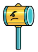
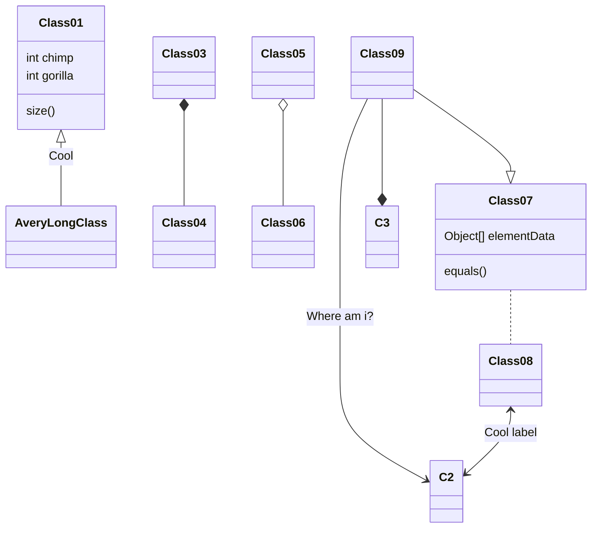
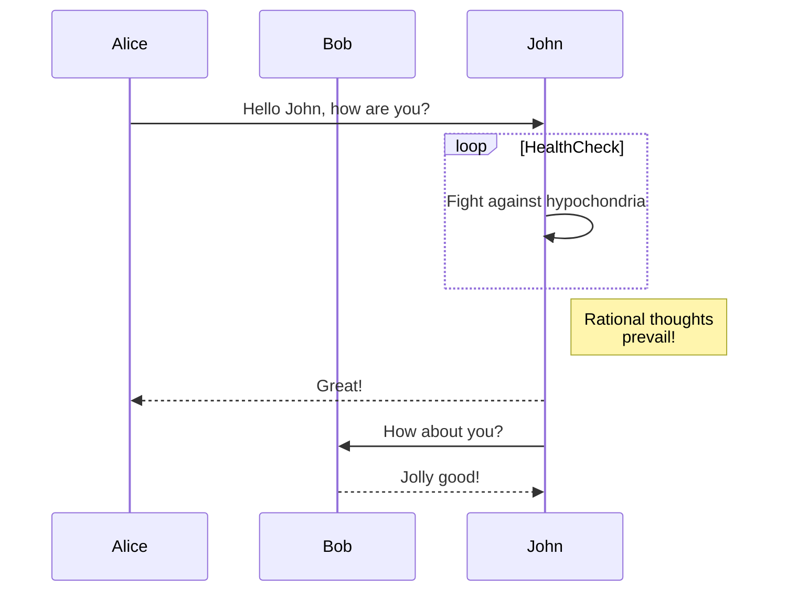

[TOC]

# Objectif du readme

- description du projet
- procédure et conseils d'installation
- mode d'emploi
- infos le(s) auteur(s)
- capture écrans
- liste de choses à faire



[Documentation](https://www.markdownguide.org)

# Markdown

1. toto
1. toto
1. toto
1. toto
1. toto

tache a faire

- [x] c fait
- [ ] pas fait

```html
<h1>Titre</h1>
```




